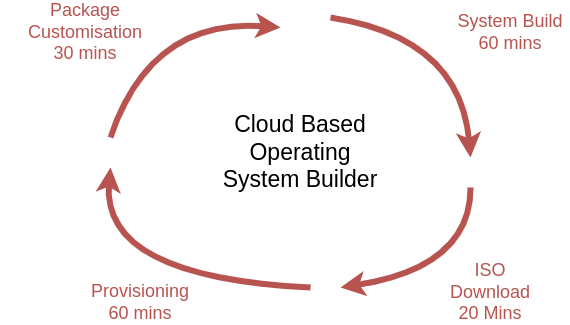
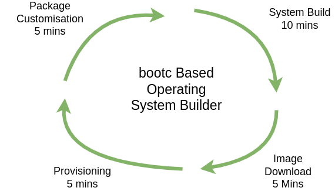

---
date:
  created: 2025-02-01
tags:
    - article
---
# Why bootc? 

At [Mehal Technologies](https://mehal.tech) are very impressed with [bootable containers (bootc)](https://docs.fedoraproject.org/en-US/bootc/getting-started/)

It's enabled us to support our partners smart edge solutions and helps them deliver features and patches faster. 

To give an idea of the time savings lets look at a typical SaaS based edge operating system builder and compare that to bootc.

In the comparison below we see an 80% improvement in effort - Going from 2 deployments a day at best to 2 builds an hour as standard. 

### Traditional Cloud Build System

The times on the above diagram are fair and may even be a little light.

* For Package Customization we only considered updating an already existing package not building a package server and [building a new custom package](https://developers.redhat.com/blog/2019/03/18/rpm-packaging-guide-creating-rpm#) for it which would likely take a day or more work.

* With system builds we found that cloud providers work with shared resources so generating the ISO for download can take up to an hour.

* Once the builds are complete the ISOs have to be downloaded and again there is usually throttling and/or contention. 

* And finally for provisioning the ISO needs to be flashed to a USB drive and then the operating system needs to be configured and validated.

So it's around 170+ mins from change to deploy.

### Container Based Operating System

The times on the above diagram will vary on the build time of the app you're deploying but match what we see during delivery.

* Package builds are light weight and container based so our dev team doesn't need any legacy packaging skills.

* The use of base images means that a whole ISO doesn't need to be created on each build so the time to build and make available is greatly reduced.

* For downloads containers have a layering strategy which ensures only the top layers are delivered as necessary 

* Once the device has been provisioned for the first time updates can be synced automatically seriously reducing the amount of time compared to the flash/configure/validate.

Hopefully that's convinced you to adopt bootc for your smart device edge solutions and if you do we believe the tools in [ubiquitous factory](https://github.com/ubiquitous-factory) will help you accelerate even more. 